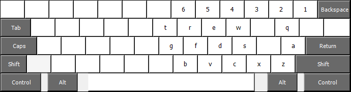

# Right-Handed "Mirrorboard" Keyboard Layout for Windows

A keyboard layout for right-handed use, based on [xkcd's article](https://blog.xkcd.com/2007/08/14/mirrorboard-a-one-handed-keyboard-layout-for-the-lazy/ "Mirrorboard: A one-handed keyboard layout for the lazy").

When <kbd>AltGr</kbd> is pressed, the standard US keyboard layout turns into this:

## Installation

Run [setup.exe](usmbrh/setup.exe) and then configure the layout "US - Mirrorboard (right-handed)" in your keyboard settings.
